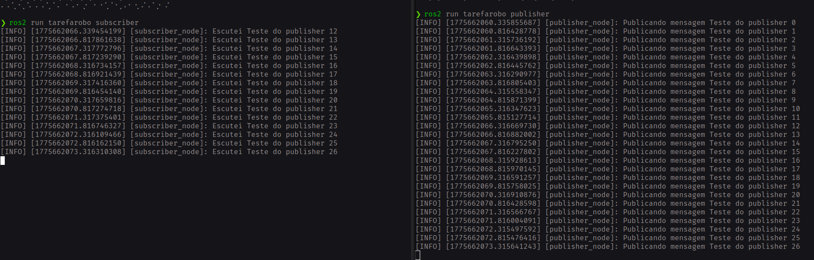
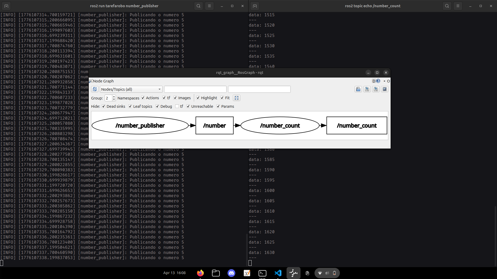

# Publisher e Subscriber
Esse pacote possui dois nós o publisher e o subscriber, o publisher ele publica dados em um topico e o subscriber le esses dados que são publicados e faz algo com eles  
## Criação do pacote  
Para criar o pacote usamos alguns comandos que utilizam o ROS nesse projeto estou usando o ROS jazzy que ja precisa estar instalado no seu pc, primeiro crie uma pasta para ser seu workspace  
```bash
cd ~
mkdir ~/program_ws/src
```
Depois disso criaremos o pacote em python usando os comandos (o ultimo nome é o nome do seu pacote nesse caso "tarefarobo")  
```bash
ros2 pkg create --build-type ament_python --license Apache-2.0 --dependencies rclpy tarefarobo 
```
# Criando os nodes  
Para criar os nodes basta criar os arquivos em python na pasta ~/program_ws/src/tarefarobo/tarefarobo e criar o codigo  
# Como eles funcionam  
## Publisher  
Para fazer os nodes funcionarem primeiro importamos algumas bibliotecas imoportantes  
```python
import rclpy
from rclpy.node import Node 
from std_msgs.msg import String #Tipo de mensagem que sera publicada pelo publisher
```  
Apos isso criamos a classe do publisher  
```python
class publisher(Node):
```
Criamos uma função de inicialização  
```python
def __init__ (self ):

  super().__init__("publisher_node")  #Chama a classe do node e da um nome pra ela 
  self.publisher = self.create_publisher(String, 'topic', 10) #Cria o publisher e coloca parametros de tipos de mensagem e o topico
  tempo = 0.5 
  self.timer = self.create_timer(tempo, self.callback) #Cria um timer para rodar a função callback
  self.msg_num = 0 #Variavel de contagem
```
E uma função callback que sera chamada a cada intervalo de tempo  
```python
def callback (self):

  msg = String()  #Coloca o tipo de mensagem
  msg.data = "Teste do publisher %d" % self.msg_num  #Coloca o contrudo da mensagem 
  self.publisher.publish(msg)  #Publica a mensagem 
  self.get_logger().info("Publicando mensagem %s" % msg.data)  #Printa no terminal que a mensagem foi publicada 
  self.msg_num += 1 #Adiciona 1 na contagem
```
Depois criamos outra função para fazer a inicialização e rodar o node de fato  
```python
def main(args=None):

    rclpy.init(args=args) #Inicializa a biblioteca 
    publisher_node = publisher()
    rclpy.spin(publisher_node)  #Roda o node
    publisher_node.destroy_node()  #Destroi o node
    rclpy.shutdown()  #Finaliza a biblioteca
```
E por fim iniciamos essa função main usando  
```python
if __name__ =='__main__':
    main()
```
## Subscriber  
Para o subscriber os imports são os mesmo e a criação da classe so muda o nome  
```python
class subscriber(Node):
```
A função de inicialização fica assim  
```python
def __init__(self):

  super().__init__("subscriber_node") #Chama a classe e da um nome pra ela 
  self.subscriber = self.create_subscription(String, 'topic', self.callback, 10) #Cria o subscriber colocando o tipo de mensagem o topico e a função callback

```
A callback agora  
```python
def callback(self, msg):

  self.get_logger().info("Escutei %s" % msg.data) #Printa a mensagem que ele escutou
```
A main tambem é quase igual  
```python
def main(args=None):

    rclpy.init(args=args)#Inicializa a biblioteca 
    subscriber_node = subscriber()
    rclpy.spin(subscriber_node) #Roda o node
    subscriber_node.destroy_node() #Destroi o node
    rclpy.shutdown #Finaliza a biblioteca
```
E por fim a inicialização da main de novo  
```python
if __name__ == '__main__':
    main()
```
# Alterações nos setups  
Depois de concluir o codigo precisamos atualizar alguns setups para o nó rodar corretamente sendo eles o setup.py e o package.xml, para o setup.py precisamos adicionar entry points para o ROS interpretar os comandos que vamos dar no terminal depois, normalmente os entry points estão assim  
```python
    entry_points={
        'console_scripts': [

        ],
    },
```
E quando adicionarmos eles ficarão assim  
```python
    entry_points={
        'console_scripts': [
            'publisher = tarefarobo.publisher_python:main',
            'subscriber = tarefarobo.subscriber_python:main',
        ],
    },
```
Agora para o package.xml precisamos colocar as bibliotecas que o nosso nó usa colocando as linhas  
```xml
  <exec_depend>rclpy</exec_depend>
  <exec_depend>std_msgs</exec_depend>
```
Fazendo o arquivo ficar assim  
```xml
<?xml version="1.0"?>
<?xml-model href="http://download.ros.org/schema/package_format3.xsd" schematypens="http://www.w3.org/2001/XMLSchema"?>
<package format="3">
  <name>tarefarobo</name>
  <version>0.0.0</version>
  <description>TODO: Package description</description>
  <maintainer email="felipiniobrsp@gmail.com">pato</maintainer>
  <license>TODO: License declaration</license>

  <test_depend>ament_copyright</test_depend>
  <test_depend>ament_flake8</test_depend>
  <test_depend>ament_pep257</test_depend>
  <test_depend>python3-pytest</test_depend>

  <exec_depend>rclpy</exec_depend>
  <exec_depend>std_msgs</exec_depend>

  <export>
    <build_type>ament_python</build_type>
  </export>
</package>
```
# Buildar e rodar o nó  
Depois de todas essas alterações podemos buildar o nosso pacote usando o comando  
```bash
colcon build --packages-select tarefarobo
```
Ou usamos só o colcon build para buildar todos os pacotes de uma vez  
## Rodar o nó  
Se tudo der certo com o colcon build podemos rodar o nó primeiro inicializamos o ROS em dois terminais usando essa sequencia de comandos  
```bash
source /opt/ros/jazzy/setup.zsh
cd ~/program_ws
source install/setup.bash
```
Agora com o ROS iniciado rodamos um comando em cada terminal  
```bash
ros2 run tarefarobo subscriber
```
```bash
ros2 run tarefarobo publisher
```
Rodando o nó o publisher vai publicar as mesagens e ir aumentando o contador e o subscriber ira ler as mensagens publicadas  

  
# Contador utilizando o ROS  
Para fazer o contador utilizei o mesmo pacote apenas fiz outros nodes para fazer os contadores, a proposta é fazer um node que publica apenas um valor e outro node que leia esse valor coloque esse numero no contador e publique o resultado em outro topico
## Explicando o codigo  
### Publisher  
O cogido do publisher é quase igual o outro porem ao invez de mandarmos strings mandamos apenas um numero  
```python
import rclpy
from rclpy.node import Node
from std_msgs.msg import Int64 #Int64 é usado para publicar numeros
```
O init é igual  
```python
def __init__ (self):

        topic = "/number" #Topico que sera publicado

        super().__init__("number_publisher")

        #Cria o publisher
        self.number_publisher = self.create_publisher(Int64, topic, 10)

        #Timers
        timer = 0.5
        self.timer = self.create_timer(timer, self.callback)
```
Agora o callback muda um pouco  
```python
    def callback (self):

        #Publica o numero 5 varias vezes 
        msg = Int64() #Tipo da mensagem int
        msg.data = 5 #Um numero apenas
        self.number_publisher.publish(msg) 
        self.get_logger().info("Publicando o numero %d" % msg.data)
```
O resto para rodar o node é igual  
```python
def main(args=None):

    rclpy.init(args=args)
    number_publisher = number_publisher_node()
    rclpy.spin(number_publisher)
    number_publisher.destroy_node()
    rclpy.shutdown()

if __name__ == "__main__":
    main()
```
### Subscriber e publisher  
Agora o outro nó que muda bastante os imports importamos o int64 de novo  
```python
import rclpy
from rclpy.node import Node
from std_msgs.msg import Int64
```
No init criamos dois topicos um subscriber e um publisher  
```python
    def __init__(self):

        #Topico para receber
        topic = "/number"

        #Novo topico para enviar
        topic_count = "/number_count"

        super().__init__('number_count')

        #Contador
        self.count = 0

        #Cria o subscriber e o novo publisher
        self.sub = self.create_subscription(Int64, topic, self.callback, 10)
        self.counter = self.create_publisher(Int64, topic_count, 10)
```
Agora no callback guardamos a msg.data em uma variavel, usamos o count para começar a contagem dos valores e depois publicamos esse novo valor usando o publisher no topico /number_count  
```python
    def callback (self, msg):

        #Armazena o valor lido pelo subscriber
        self.number = msg.data

        #Conta os numeros recebidos
        self.count = self.count + self.number

        #publica a soma dos numeros recebidos
        msg_count = Int64()
        msg_count.data = self.count
        self.counter.publish(msg_count)    

        #Log para aparecer as soma 
        self.get_logger().info("A soma dos valores deu: %d" % msg_count.data)
```
E o resto continua igual  
```python
def main (args=None):

    rclpy.init(args=args)
    number_count = number_count_node()
    rclpy.spin(number_count)
    number_count.destroy_node()
    rclpy.shutdown()

if __name__ == "__main__":
    main()
```  
Precisamos depois disso atualizar o setup.py para colocar os novos entry points  
```python
'number_publisher = tarefarobo.number_publisher:main',
'number_count = tarefarobo.number_count:main',
```
## Rodando o node  
Antes de rodar o node precisamos buildar ele usando  
```bash
colcon build
```
E para rodar os nodes rodamos  
```bash
ros2 run tarefarobo number_publisher
ros2 run tarefarobo number_count
```
E se quisermos ver o que esta sendo publicado no topico rodamos  
```bash
ros2 topic echo /number_count
```
Se tudo der certo ficara assim e rodando o rqt_graph tambem  
  


  


